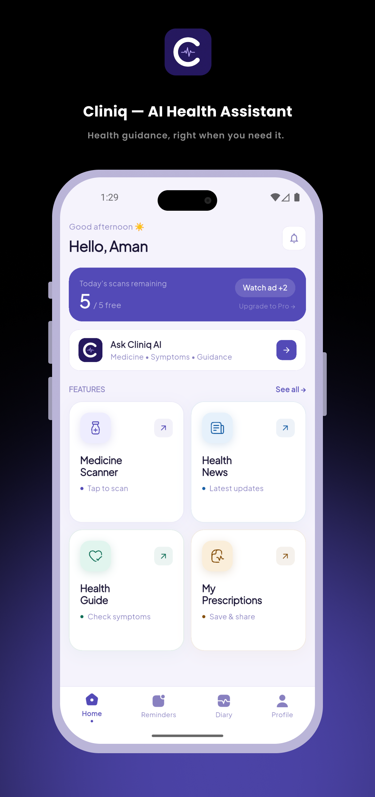

# Cliniq — AI Health Assistant

> Your health, answered instantly.

Cliniq is an AI-powered health assistant app built for Indian users. Ask health questions, scan medicines, track daily health, save prescriptions, and stay updated with health news — all in one place.

<br>

## 📸 Screenshots

| Home | Ask Cliniq AI | Medicine Scanner | Prescription Vault |
|------|--------------|-----------------|-------------------|
|  |  |  |  |

| Sehat Diary | Health News | Reminders | Profile |
|-------------|-------------|-----------|---------|
|  |  |  |  |

<br>

## ✨ Features

- 🤖 **Ask Cliniq AI** — Instant AI-powered health guidance via chat
- 💊 **AI Medicine Scanner** — Scan any medicine label using ML Kit OCR + Gemini AI
- 🏥 **AI Sickness Guide** — Multi-turn symptom checker with smart health insights
- 📋 **Prescription Vault** — Scan, save & organize prescriptions with AI summary
- 📓 **Sehat Diary** — Daily health check-in with mood, symptoms, water & streak tracking
- 📰 **Daily Health News** — Curated health updates via GNews API
- 🔔 **Medicine Reminders** — Morning/Afternoon/Night reminders with local notifications
- 🌙 **Dark & Light Mode** — Full theme support with Plus Jakarta Sans design system
- ⚡ **5 Free Credits/Day** — Daily free AI usage for all users
- 👑 **Cliniq Pro** — Unlimited access via subscription (₹149/month)

<br>

## 🛠️ Tech Stack

| Layer | Technology |
|-------|-----------|
| Framework | Flutter (Android) |
| Auth | Firebase Auth + Google Sign-In |
| Database | Cloud Firestore + SQLite (sqflite) |
| Storage | Firebase Storage |
| Notifications | FCM + flutter_local_notifications |
| AI | Cloud Functions → OpenRouter (Gemini 2.5 Flash) |
| OCR | Google ML Kit Text Recognition |
| Subscriptions | RevenueCat (purchases_flutter) |
| Ads | Google AdMob (Rewarded) |
| Config | Firebase Remote Config |
| State Management | Provider |
| Navigation | go_router |
| Admin Panel | Flutter Web |

<br>

## 🏗️ Architecture

```
lib/
├── core/
│   ├── theme.dart
│   ├── constants.dart
│   ├── routes.dart
│   └── router.dart
├── models/
│   ├── chat_message_model.dart
│   ├── reminder_model.dart
│   ├── prescription_model.dart
│   ├── diary_entry_model.dart
│   ├── news_model.dart
│   └── app_config_model.dart
├── database/
│   ├── database_helper.dart
│   └── daos/
├── services/
│   ├── auth_service.dart
│   ├── firestore_service.dart
│   ├── notification_service.dart
│   ├── prescription_service.dart
│   ├── purchase_service.dart
│   ├── ad_service.dart
│   ├── diary_service.dart
│   └── app_config_service.dart
├── providers/
└── screens/
    ├── splash/
    ├── onboarding/
    ├── auth/
    ├── home/
    ├── medicine_scanner/
    ├── sickness/
    ├── reminders/
    ├── prescriptions/
    ├── diary/
    ├── news/
    └── profile/
```

<br>

## ☁️ Cloud Functions (asia-south1)

| Function | Type | Purpose |
|----------|------|---------|
| `onUserCreate` | onDocumentCreated | 5 credits on signup |
| `scanMedicine` | onCall | Gemini AI + cache + Pro check |
| `sicknessGuide` | onCall | Multi-turn symptom guide + Pro check |
| `summarizePrescription` | onCall | OCR → AI medicine summary |
| `rewardAdCredits` | onCall | +2 credits per rewarded ad |
| `generateDiaryInsights` | onCall | Weekly AI health analysis |
| `fetchHealthNews` | onSchedule | Daily GNews fetch + cleanup |
| `sendNotification` | onDocumentCreated | FCM to user segments |

<br>

## 🗄️ Firestore Structure

```
appConfig/config
  ├── announcementActive, announcementText
  ├── forceUpdateVersion, maintenanceMode
  ├── maxAdsPerDay: 2, adCreditsPerAd: 2
  ├── freeCreditsPerDay: 5
  └── gnews_api_key, proPrice

users/{uid}
  ├── name, email, photoUrl
  ├── plan: 'free' | 'pro'
  ├── freeCredits, adCredits, adsWatchedToday
  ├── fcmToken
  ├── /scans
  ├── /reminders
  └── /diary/{date}

health_news/{docId}
medicine_cache/{name}
notifications_log/{docId}
```

<br>

## 💰 Monetization

| Tier | Credits | Price |
|------|---------|-------|
| Free | 5/day + 2 per rewarded ad (max 2 ads/day) | Free |
| Pro | Unlimited | ₹149/month |

- RevenueCat Entitlement ID: `Cliniq Pro`
- API Key sourced from Firebase Remote Config

<br>

## 🎨 Design System

```
Font:        Plus Jakarta Sans
Primary:     #534AB7 (light) / #7C75D8 (dark)
Background:  #F5F3FC (light) / #141218 (dark)
Surface:     #FFFFFF (light) / #1E1B2C (dark)
Success:     #10B981
Danger:      #FF4757
Warning:     #F59E0B
```

<br>

## 🚀 Getting Started

### Prerequisites
- Flutter SDK >= 3.0.0
- Firebase project configured
- OpenRouter API key
- RevenueCat account

### Setup

1. **Clone the repo**
```bash
git clone https://github.com/yourusername/cliniq.git
cd cliniq
```

2. **Install dependencies**
```bash
flutter pub get
```

3. **Firebase setup**
```bash
flutterfire configure
```

4. **Run the app**
```bash
flutter run
```

> ⚠️ `google-services.json` and keystore files are excluded from this repo for security.

<br>

## 📋 Coding Conventions

```
✅ withAlpha() not withOpacity()
✅ mounted checks after every await
✅ rootNavigator: true for detail screens
✅ Provider + services architecture
✅ No direct Firebase calls from screens
✅ debugPrint() not print()
```

<br>

## 📦 App Info

| Field | Value |
|-------|-------|
| Package | `com.cliniqai.app` |
| Firebase Project | `sehat-samjho-prod-2de9e` |
| Version | `1.0.0+1` |
| Platform | Flutter Android |
| Play Store | Internal Testing |

<br>

## ⚠️ Disclaimer

Cliniq is an AI health assistant for informational and guidance purposes only. It is not a substitute for professional medical advice, diagnosis, or treatment. Always consult a qualified healthcare provider for medical decisions.

<br>

## 👨‍💻 Developer

**Aman** — Flutter Developer
- Portfolio: [your-portfolio-link]
- LinkedIn: [your-linkedin]
- Email: [your-email]

<br>

## 📄 License

This project is proprietary and not open source.

© 2026 Cliniq. All rights reserved.
